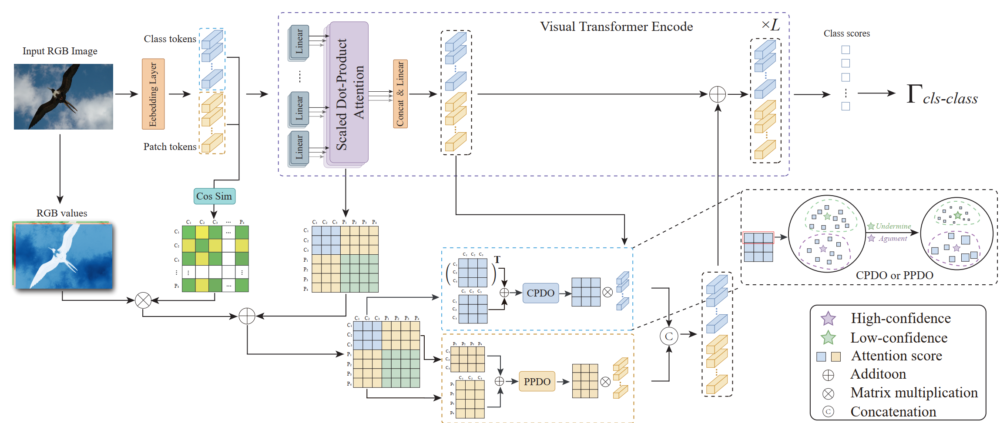

# DOEI
This is the code repository for the paper:

> DOEI: DOEI: Dual Optimization of Embedding Information for Attention-Enhanced Class Activation Maps
Hongjie Zhu, [Zeyu Zhang](https://example.com/zeyu), Guansong Pang, Xu Wang, Shimin Wen, Yu Bai, Daji Ergu, Ying Cai* and Yang Zhao

*Corresponding author

[arXiv] [Paper with Code]

# Introduction
Weakly supervised semantic segmentation (WSSS) typically utilizes limited semantic annotations to obtain initial Class Activation Maps (CAMs). However, due to the inadequate coupling between class activation responses and semantic information in high-dimensional space, the CAM is prone to object co-occurrence or under-activation, resulting in inferior recognition accuracy. To tackle this issue, we propose DOEI, Dual Optimization of Embedding Information, a novel approach that reconstructs embedding representations through semantic-aware attention weight matrices to optimize the expression capability of embedding information. Specifically, DOEI amplifies tokens with high confidence and suppresses those with low confidence during the class-to-patch interaction. This alignment of activation responses with semantic information strengthens the propagation and decoupling of target features, enabling the generated embeddings to more accurately represent target features in high-level semantic space. In addition, we propose a hybrid-feature alignment module in DOEI that combines RGB values, embedding-guided features, and self-attention weights to increase the reliability of candidate tokens. Comprehensive experiments show that DOEI is an effective plug-and-play module that empowers state-of-the-art visual transformer-based WSSS models to significantly improve the quality of CAMs and segmentation performance on popular benchmarks, including PASCAl VOC (+3.6%, +1.5%, +1.2% mIoU) and MS COCO (+1.2%, +1.6% mIoU).
